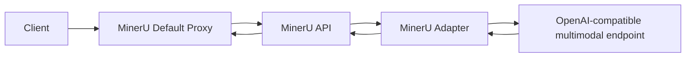

# MinerU Adapter

[中文](./README.md) | English

MinerU Adapter is a lightweight OpenAI-compatible proxy that lets MinerU `vlm-http-client` / `hybrid-http-client` call an external multimodal model endpoint.

It is not a MinerU output simulator. The upstream multimodal model is responsible for recognition quality; the adapter keeps the response shape stable for MinerU downstream processing.

## Table Of Contents

- [Features](#features)
- [How It Works](#how-it-works)
- [Quick Start](#quick-start)
- [Docker](#docker)
- [Configuration](#configuration)
- [Default Parameter Proxy](#default-parameter-proxy)
- [MinerU Integration](#mineru-integration)
- [API](#api)
- [Response Shape](#response-shape)
- [Testing](#testing)
- [Project Layout](#project-layout)

## Features

- Provides OpenAI-compatible `/v1/chat/completions` and `/v1/models` endpoints.
- Detects MinerU tasks: `Layout Detection`, `Text Recognition`, `Table Recognition`, `Formula Recognition`, and `Image Analysis`.
- Converts upstream layout JSON into MinerU layout tags.
- Normalizes coordinates into MinerU's 0-1000 coordinate space.
- Maps layout labels into MinerU-supported block types.
- Strips Markdown code fences from text, table, and formula outputs.
- Optionally writes debug records for requests, raw upstream responses, and rewritten responses.
- Provides a default parameter proxy that injects `backend` and `server_url` for MinerU `/file_parse` requests.

## How It Works



The adapter only handles protocol and response shaping:

- OpenAI chat completion envelope stays compatible.
- Layout output is rewritten as MinerU tags.
- Table output is expected as HTML table.
- Formula output is expected as a LaTeX string.
- Text and image analysis outputs are expected as plain text.

## Quick Start

```bash
python -m venv .venv
source .venv/bin/activate
python -m pip install -e .

export UPSTREAM_BASE_URL=http://127.0.0.1:8000
export UPSTREAM_MODEL=vl-model

uvicorn mineru_adapter.api:app --host 0.0.0.0 --port 18000
```

Windows PowerShell:

```powershell
python -m venv .venv
.\.venv\Scripts\python.exe -m pip install -e .

$env:UPSTREAM_BASE_URL = "http://127.0.0.1:8000"
$env:UPSTREAM_MODEL = "vl-model"

.\.venv\Scripts\python.exe -m uvicorn mineru_adapter.api:app --host 0.0.0.0 --port 18000
```

Health check:

```bash
curl http://127.0.0.1:18000/health
```

## Docker

```bash
docker compose -f docker-compose.example.yml up --build
```

`docker-compose.example.yml` starts three services by default:

| Service | Purpose |
| --- | --- |
| `official-mineru` | MinerU API, listening on internal port `8000` |
| `mineru-adapter` | OpenAI-compatible multimodal adapter, listening on internal port `18000` |
| `mineru-default-proxy` | Public entrypoint on `31000`; injects MinerU http-client parameters |

If the upstream multimodal service is not running on the host machine, update `UPSTREAM_BASE_URL` for `mineru-adapter`.

After deployment, clients can keep calling:

```text
http://<host>:31000/file_parse
```

They do not need to send `server_url` on each request.

## Configuration

Adapter configuration:

| Variable | Default | Description |
| --- | --- | --- |
| `UPSTREAM_BASE_URL` | `http://127.0.0.1:8000` | Upstream OpenAI-compatible multimodal endpoint |
| `UPSTREAM_MODEL` | `vl-model` | Model name sent to the upstream endpoint |
| `REQUEST_TIMEOUT` | `120` | Upstream request timeout in seconds |
| `DROP_UNSUPPORTED_PARAMS` | `true` | Drop MinerU/vLLM-specific request fields |
| `STRIP_REASONING` | `true` | Remove reasoning fields from responses |
| `DISABLE_UPSTREAM_THINKING` | `true` | Send `chat_template_kwargs.enable_thinking=false` to upstream vLLM to disable thinking output from reasoning models such as Qwen3 |
| `LAYOUT_MAX_TOKENS` | `1024` | Maximum output tokens for Layout Detection; larger upstream requests are capped |
| `TEXT_MAX_TOKENS` | `2048` | Maximum output tokens for Text Recognition |
| `TABLE_MAX_TOKENS` | `2048` | Maximum output tokens for Table Recognition |
| `FORMULA_MAX_TOKENS` | `512` | Maximum output tokens for Formula Recognition |
| `IMAGE_MAX_TOKENS` | `1024` | Maximum output tokens for Image Analysis |
| `LAYOUT_MAX_IMAGE_SIDE` | `896` | Longest image side for Layout Detection downsampling; set `0` to disable |
| `LAYOUT_JPEG_QUALITY` | `90` | Quality used when preserving JPEG/WebP layout images after downsampling |
| `ADAPTER_CACHE_SIZE` | `256` | Maximum in-memory adapter response cache entries; set `0` to disable |
| `ADAPTER_CACHE_TTL_SECONDS` | `3600` | In-memory adapter response cache TTL in seconds; set `0` to disable |
| `ADAPTER_COALESCE_REQUESTS` | `true` | Coalesce concurrent identical upstream requests to avoid duplicate model calls |
| `ADAPTER_DEBUG_ASYNC` | `true` | Write debug JSON records on a background thread so logging does not block responses |
| `ADAPTER_DEBUG_MAX_TEXT_CHARS` | `20000` | Maximum characters kept for each text field in debug records; set `0` to disable truncation |
| `ADAPTER_DEBUG_PRETTY_JSON` | `false` | Write indented debug JSON when enabled; compact JSON is used by default to reduce IO |
| `ADAPTER_DEBUG_DIR` | empty | Directory for debug records |

Default proxy configuration:

| Variable | Default | Description |
| --- | --- | --- |
| `MINERU_API_BASE_URL` | `http://official-mineru:8000` | MinerU API target URL |
| `DEFAULT_BACKEND` | `vlm-http-client` | Injected backend when the request does not include `backend` |
| `DEFAULT_SERVER_URL` | `http://mineru-adapter:18000` | Injected adapter URL when the request does not include `server_url` |
| `PROXY_REQUEST_TIMEOUT` | `600` | Timeout for MinerU API requests in seconds |
| `FORCE_DEFAULTS` | `false` | Force override existing `backend/server_url` request fields |
| `AUTO_TEXT_PDF_ROUTING` | `true` | Detect text-layer PDFs and route them to `TEXT_PDF_BACKEND` when the request does not explicitly include `backend` |
| `TEXT_PDF_BACKEND` | `pipeline` | MinerU backend used for text-layer PDF auto routing |
| `TEXT_PDF_MIN_CHARS` | `120` | Minimum non-whitespace characters from sampled pages to classify a PDF as text-layer |
| `TEXT_PDF_SCAN_PAGES` | `3` | Maximum pages scanned for text-layer detection |

## Default Parameter Proxy

The default parameter proxy only injects fields for multipart `POST /file_parse` requests. By default:

- If the request has no `backend`, it injects `DEFAULT_BACKEND`.
- If the request has no `server_url`, it injects `DEFAULT_SERVER_URL`.
- If the request already includes `backend/server_url`, the caller-provided values are preserved.
- If `AUTO_TEXT_PDF_ROUTING` is enabled and the request does not explicitly include `backend`, text-layer PDFs are routed to `TEXT_PDF_BACKEND` and skip the adapter VLM.

The proxy adds routing diagnostic response headers:

| Header | Description |
| --- | --- |
| `x-mineru-proxy-route` | Route result such as `default`, `text-pdf`, or `explicit-backend` |
| `x-mineru-proxy-backend` | Final backend sent to MinerU |
| `x-mineru-proxy-server-url` | Final server_url sent to MinerU; only present for http-client backends |
| `x-mineru-proxy-text-pdf` | Whether the file was classified as a text-layer PDF |
| `x-mineru-proxy-text-pdf-checked` | Whether text-layer detection ran; explicit `backend` requests skip it by default |

To force every request through the adapter, set:

```yaml
FORCE_DEFAULTS: "true"
```

With this option enabled, even caller-provided `pipeline` or custom `server_url` values are replaced by the proxy defaults.

## MinerU Integration

Start MinerU API with http-client backends enabled:

```bash
mineru-api --host 0.0.0.0 --port 8000 --allow-public-http-client
```

When calling MinerU, pass:

```text
backend=hybrid-http-client
server_url=http://<adapter-host>:18000
```

When using the default parameter proxy, clients can omit `backend/server_url`; the proxy injects them automatically. You can also call MinerU API directly and pass both fields explicitly.

Both `vlm-http-client` and `hybrid-http-client` are supported. `vlm-http-client` is cleaner for reducing MinerU-side GPU usage; `hybrid-http-client` keeps more of MinerU's local structured processing.

To minimize MinerU GPU usage, run MinerU without GPU access or set:

```bash
MINERU_DEVICE_MODE=cpu
```

MinerU CLI environment example:

```bash
export MINERU_BACKEND=hybrid-http-client
export MINERU_HTTP_CLIENT_URL=http://<adapter-host>:18000
export MINERU_VL_MODEL_NAME=vl-model
```

## API

```text
GET  /health
GET  /v1/models
POST /v1/chat/completions
```

`POST /v1/chat/completions` accepts OpenAI chat completion requests and returns an OpenAI chat completion response.

## Response Shape

Layout task content is rewritten as:

```text
<|box_start|>x1 y1 x2 y2<|box_end|><|ref_start|>type<|ref_end|><|rotate_up|>
```

Coordinates are always in the `0-1000` range. `type` is mapped to MinerU-supported block types, for example:

```text
text, title, table, equation, image, chart, header, footer, page_number
```

The upstream service may return JSON, Markdown fenced JSON, or JSON with surrounding text. The adapter tries to extract the first JSON array and convert it into MinerU tags.

## Testing

```bash
python -m pip install -e .[test]
pytest
```

Run a smoke test:

```bash
python scripts/smoke_adapter.py --adapter-url http://127.0.0.1:18000 --image ./examples/page.png --task layout
```

If `mineru-vl-utils` is installed:

```bash
python scripts/mineruclient_layout_smoke.py --adapter-url http://127.0.0.1:18000 --image ./examples/page.png
```

## Project Layout

```text
.
├── src/mineru_adapter
│   ├── api.py
│   ├── config.py
│   ├── default_proxy.py
│   ├── layout.py
│   ├── messages.py
│   └── proxy.py
├── scripts
├── tests
├── Dockerfile
├── docker-compose.example.yml
├── pyproject.toml
├── README.md
└── README.en.md
```
