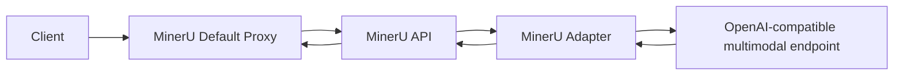

# MinerU Adapter

中文 | [English](./README.en.md)

MinerU Adapter 是一个轻量级 OpenAI-compatible 代理服务，用于让 MinerU 的 `vlm-http-client` / `hybrid-http-client` 调用外部多模态模型服务。

它不是 MinerU 输出模拟器。上游多模态模型负责识别质量，adapter 负责把响应整理成 MinerU 下游能够稳定消费的输出形状。

## 目录

- [功能特性](#功能特性)
- [工作方式](#工作方式)
- [快速开始](#快速开始)
- [Docker](#docker)
- [配置项](#配置项)
- [默认参数代理](#默认参数代理)
- [接入 MinerU](#接入-mineru)
- [API](#api)
- [输出形状](#输出形状)
- [测试](#测试)
- [项目结构](#项目结构)

## 功能特性

- 提供 OpenAI-compatible `/v1/chat/completions` 和 `/v1/models` 接口。
- 自动识别 MinerU 任务：`Layout Detection`、`Text Recognition`、`Table Recognition`、`Formula Recognition`、`Image Analysis`。
- 将上游 layout JSON 转换为 MinerU 所需的 tag 格式。
- 将坐标统一归一化到 MinerU 的 0-1000 坐标空间。
- 将 layout type 映射到 MinerU 支持的 block type 集合。
- 清理文本、表格、公式任务中的 Markdown code fence。
- 支持 debug 目录记录请求、上游原始响应和 adapter 改写结果。
- 提供默认参数代理，自动为 MinerU `/file_parse` 请求补齐 `backend` 和 `server_url`。

## 工作方式



adapter 只处理协议和输出形状：

- OpenAI chat completion 外壳保持兼容。
- layout 输出固定为 MinerU tag。
- table 输出固定为 HTML table。
- formula 输出固定为 LaTeX 字符串。
- text 和 image analysis 输出固定为纯文本。

## 快速开始

```bash
python -m venv .venv
source .venv/bin/activate
python -m pip install -e .

export UPSTREAM_BASE_URL=http://127.0.0.1:8000
export UPSTREAM_MODEL=vl-model

uvicorn mineru_adapter.api:app --host 0.0.0.0 --port 18000
```

Windows PowerShell:

```powershell
python -m venv .venv
.\.venv\Scripts\python.exe -m pip install -e .

$env:UPSTREAM_BASE_URL = "http://127.0.0.1:8000"
$env:UPSTREAM_MODEL = "vl-model"

.\.venv\Scripts\python.exe -m uvicorn mineru_adapter.api:app --host 0.0.0.0 --port 18000
```

健康检查：

```bash
curl http://127.0.0.1:18000/health
```

## Docker

```bash
docker compose -f docker-compose.example.yml up --build
```

`docker-compose.example.yml` 默认启动三个服务：

| 服务 | 作用 |
| --- | --- |
| `official-mineru` | MinerU API，内部监听 `8000` |
| `mineru-adapter` | OpenAI-compatible 多模态适配层，内部监听 `18000` |
| `mineru-default-proxy` | 对外暴露 `31000`，自动补齐 MinerU http-client 参数 |

如果上游多模态服务不在宿主机本地，请修改 `mineru-adapter` 的 `UPSTREAM_BASE_URL`。

部署后，业务系统继续请求：

```text
http://<host>:31000/file_parse
```

不需要在每个请求里传 `server_url`。

## 配置项

Adapter 配置：

| 环境变量 | 默认值 | 说明 |
| --- | --- | --- |
| `UPSTREAM_BASE_URL` | `http://127.0.0.1:8000` | 上游 OpenAI-compatible 多模态服务地址 |
| `UPSTREAM_MODEL` | `vl-model` | 转发给上游服务的模型名 |
| `REQUEST_TIMEOUT` | `120` | 请求上游服务的超时时间，单位秒 |
| `DROP_UNSUPPORTED_PARAMS` | `true` | 是否丢弃 MinerU/vLLM 专有参数 |
| `STRIP_REASONING` | `true` | 是否从响应中移除 reasoning 字段 |
| `DISABLE_UPSTREAM_THINKING` | `true` | 是否向上游 vLLM 发送 `chat_template_kwargs.enable_thinking=false`，用于关闭 Qwen3 等 reasoning 模型的思考输出 |
| `LAYOUT_MAX_TOKENS` | `1024` | Layout Detection 的最大输出 token，上游请求更大时会被压到该值 |
| `TEXT_MAX_TOKENS` | `2048` | Text Recognition 的最大输出 token |
| `TABLE_MAX_TOKENS` | `2048` | Table Recognition 的最大输出 token |
| `FORMULA_MAX_TOKENS` | `512` | Formula Recognition 的最大输出 token |
| `IMAGE_MAX_TOKENS` | `1024` | Image Analysis 的最大输出 token |
| `LAYOUT_MAX_IMAGE_SIDE` | `896` | 仅对 Layout Detection 图片降采样的最长边；设为 `0` 可关闭 |
| `ADAPTER_CACHE_SIZE` | `256` | adapter 内存响应缓存最大条数；设为 `0` 可关闭 |
| `ADAPTER_CACHE_TTL_SECONDS` | `3600` | adapter 内存响应缓存过期时间，单位秒；设为 `0` 可关闭 |
| `ADAPTER_COALESCE_REQUESTS` | `true` | 是否合并并发的相同上游请求，避免同一页同一任务重复打模型 |
| `ADAPTER_DEBUG_DIR` | 空 | 调试记录输出目录 |

默认参数代理配置：

| 环境变量 | 默认值 | 说明 |
| --- | --- | --- |
| `MINERU_API_BASE_URL` | `http://official-mineru:8000` | 代理转发到的 MinerU API 地址 |
| `DEFAULT_BACKEND` | `vlm-http-client` | 请求未传 `backend` 时自动补的 backend |
| `DEFAULT_SERVER_URL` | `http://mineru-adapter:18000` | 请求未传 `server_url` 时自动补的 adapter 地址 |
| `PROXY_REQUEST_TIMEOUT` | `600` | 代理等待 MinerU API 的超时时间，单位秒 |
| `FORCE_DEFAULTS` | `false` | 是否强制覆盖请求里已有的 `backend/server_url` |
| `AUTO_TEXT_PDF_ROUTING` | `true` | 是否检测文本层 PDF，并在请求未显式传 `backend` 时改走 `TEXT_PDF_BACKEND` |
| `TEXT_PDF_BACKEND` | `pipeline` | 文本层 PDF 自动路由使用的 MinerU backend |
| `TEXT_PDF_MIN_CHARS` | `120` | 前几页抽取文本达到多少非空白字符后判定为文本层 PDF |
| `TEXT_PDF_SCAN_PAGES` | `3` | 文本层检测扫描的最大页数 |

## 默认参数代理

默认参数代理只对 `POST /file_parse` 的 multipart 请求做字段补齐。默认行为是：

- 如果请求没有 `backend`，补 `DEFAULT_BACKEND`。
- 如果请求没有 `server_url`，补 `DEFAULT_SERVER_URL`。
- 如果请求已经带了 `backend/server_url`，默认保留调用方传入的值。

如果需要强制所有请求都走 adapter，可以设置：

```yaml
FORCE_DEFAULTS: "true"
```

这样即使调用方传了 `pipeline` 或其他 `server_url`，也会被代理覆盖。

## 接入 MinerU

启动允许 http-client backend 的 MinerU API：

```bash
mineru-api --host 0.0.0.0 --port 8000 --allow-public-http-client
```

请求 MinerU 时指定：

```text
backend=hybrid-http-client
server_url=http://<adapter-host>:18000
```

如果使用默认参数代理，请求方可以不传 `backend/server_url`，代理会自动补齐。也可以直接请求 MinerU API 并显式传这两个字段。

`vlm-http-client` 和 `hybrid-http-client` 都支持。`vlm-http-client` 更适合减少 MinerU 本地 GPU 占用；`hybrid-http-client` 会保留更多 MinerU 本地结构化处理能力。

如果目标是尽量减少 MinerU 容器的 GPU 占用，可以让 MinerU 容器不挂 GPU，或设置：

```bash
MINERU_DEVICE_MODE=cpu
```

MinerU CLI 环境变量示例：

```bash
export MINERU_BACKEND=hybrid-http-client
export MINERU_HTTP_CLIENT_URL=http://<adapter-host>:18000
export MINERU_VL_MODEL_NAME=vl-model
```

## API

```text
GET  /health
GET  /v1/models
POST /v1/chat/completions
```

`POST /v1/chat/completions` 接收 OpenAI chat completion 格式请求，并将响应包装回 OpenAI chat completion 格式。

## 输出形状

Layout 任务的最终返回内容为：

```text
<|box_start|>x1 y1 x2 y2<|box_end|><|ref_start|>type<|ref_end|><|rotate_up|>
```

坐标范围固定为 `0-1000`。`type` 会被映射到 MinerU 支持的 block type，例如：

```text
text, title, table, equation, image, chart, header, footer, page_number
```

上游服务可以输出 JSON、Markdown fenced JSON 或带说明文本的 JSON；adapter 会尽量提取 JSON 数组并转换为 MinerU tag。

## 测试

```bash
python -m pip install -e .[test]
pytest
```

运行 smoke test：

```bash
python scripts/smoke_adapter.py --adapter-url http://127.0.0.1:18000 --image ./examples/page.png --task layout
```

如果已安装 `mineru-vl-utils`：

```bash
python scripts/mineruclient_layout_smoke.py --adapter-url http://127.0.0.1:18000 --image ./examples/page.png
```

## 项目结构

```text
.
├── src/mineru_adapter
│   ├── api.py
│   ├── config.py
│   ├── default_proxy.py
│   ├── layout.py
│   ├── messages.py
│   └── proxy.py
├── scripts
├── tests
├── Dockerfile
├── docker-compose.example.yml
├── pyproject.toml
├── README.md
└── README.en.md
```
