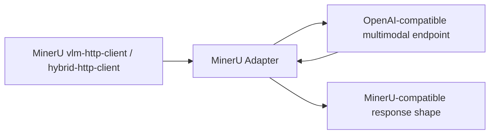

# MinerU Adapter

中文 | [English](./README.en.md)

MinerU Adapter 是一个轻量级 OpenAI-compatible 代理服务，用于让 MinerU 的 `vlm-http-client` / `hybrid-http-client` 调用外部多模态模型服务。

它不是 MinerU 输出模拟器。上游多模态模型负责识别质量，adapter 负责把响应整理成 MinerU 下游能够稳定消费的输出形状。

## 目录

- [功能特性](#功能特性)
- [工作方式](#工作方式)
- [快速开始](#快速开始)
- [Docker](#docker)
- [配置项](#配置项)
- [接入 MinerU](#接入-mineru)
- [API](#api)
- [输出形状](#输出形状)
- [测试](#测试)
- [项目结构](#项目结构)

## 功能特性

- 提供 OpenAI-compatible `/v1/chat/completions` 和 `/v1/models` 接口。
- 自动识别 MinerU 任务：`Layout Detection`、`Text Recognition`、`Table Recognition`、`Formula Recognition`、`Image Analysis`。
- 将上游 layout JSON 转换为 MinerU 所需的 tag 格式。
- 将坐标统一归一化到 MinerU 的 0-1000 坐标空间。
- 将 layout type 映射到 MinerU 支持的 block type 集合。
- 清理文本、表格、公式任务中的 Markdown code fence。
- 支持 debug 目录记录请求、上游原始响应和 adapter 改写结果。

## 工作方式



adapter 只处理协议和输出形状：

- OpenAI chat completion 外壳保持兼容。
- layout 输出固定为 MinerU tag。
- table 输出固定为 HTML table。
- formula 输出固定为 LaTeX 字符串。
- text 和 image analysis 输出固定为纯文本。

## 快速开始

```bash
python -m venv .venv
source .venv/bin/activate
python -m pip install -e .

export UPSTREAM_BASE_URL=http://127.0.0.1:8000
export UPSTREAM_MODEL=vl-model

uvicorn mineru_adapter.api:app --host 0.0.0.0 --port 18000
```

Windows PowerShell:

```powershell
python -m venv .venv
.\.venv\Scripts\python.exe -m pip install -e .

$env:UPSTREAM_BASE_URL = "http://127.0.0.1:8000"
$env:UPSTREAM_MODEL = "vl-model"

.\.venv\Scripts\python.exe -m uvicorn mineru_adapter.api:app --host 0.0.0.0 --port 18000
```

健康检查：

```bash
curl http://127.0.0.1:18000/health
```

## Docker

```bash
docker compose -f docker-compose.example.yml up --build
```

如果上游多模态服务不在宿主机本地，请修改 `docker-compose.example.yml` 中的 `UPSTREAM_BASE_URL`。

## 配置项

| 环境变量 | 默认值 | 说明 |
| --- | --- | --- |
| `UPSTREAM_BASE_URL` | `http://127.0.0.1:8000` | 上游 OpenAI-compatible 多模态服务地址 |
| `UPSTREAM_MODEL` | `vl-model` | 转发给上游服务的模型名 |
| `REQUEST_TIMEOUT` | `120` | 请求上游服务的超时时间，单位秒 |
| `DROP_UNSUPPORTED_PARAMS` | `true` | 是否丢弃 MinerU/vLLM 专有参数 |
| `STRIP_REASONING` | `true` | 是否从响应中移除 reasoning 字段 |
| `ADAPTER_DEBUG_DIR` | 空 | 调试记录输出目录 |

## 接入 MinerU

启动允许 http-client backend 的 MinerU API：

```bash
mineru-api --host 0.0.0.0 --port 8000 --allow-public-http-client
```

请求 MinerU 时指定：

```text
backend=hybrid-http-client
server_url=http://<adapter-host>:18000
```

也可以使用 `vlm-http-client`。一般建议先试 `hybrid-http-client`，让 MinerU 保留自己的结构化后处理能力，同时把 VLM 调用转发给外部多模态模型服务。

如果目标是尽量减少 MinerU 容器的 GPU 占用，可以让 MinerU 容器不挂 GPU，或设置：

```bash
MINERU_DEVICE_MODE=cpu
```

MinerU CLI 环境变量示例：

```bash
export MINERU_BACKEND=hybrid-http-client
export MINERU_HTTP_CLIENT_URL=http://<adapter-host>:18000
export MINERU_VL_MODEL_NAME=vl-model
```

## API

```text
GET  /health
GET  /v1/models
POST /v1/chat/completions
```

`POST /v1/chat/completions` 接收 OpenAI chat completion 格式请求，并将响应包装回 OpenAI chat completion 格式。

## 输出形状

Layout 任务的最终返回内容为：

```text
<|box_start|>x1 y1 x2 y2<|box_end|><|ref_start|>type<|ref_end|><|rotate_up|>
```

坐标范围固定为 `0-1000`。`type` 会被映射到 MinerU 支持的 block type，例如：

```text
text, title, table, equation, image, chart, header, footer, page_number
```

上游服务可以输出 JSON、Markdown fenced JSON 或带说明文本的 JSON；adapter 会尽量提取 JSON 数组并转换为 MinerU tag。

## 测试

```bash
python -m pip install -e .[test]
pytest
```

运行 smoke test：

```bash
python scripts/smoke_adapter.py --adapter-url http://127.0.0.1:18000 --image ./examples/page.png --task layout
```

如果已安装 `mineru-vl-utils`：

```bash
python scripts/mineruclient_layout_smoke.py --adapter-url http://127.0.0.1:18000 --image ./examples/page.png
```

## 项目结构

```text
.
├── src/mineru_adapter
│   ├── api.py
│   ├── config.py
│   ├── layout.py
│   ├── messages.py
│   └── proxy.py
├── scripts
├── tests
├── Dockerfile
├── docker-compose.example.yml
├── pyproject.toml
├── README.md
└── README.en.md
```
